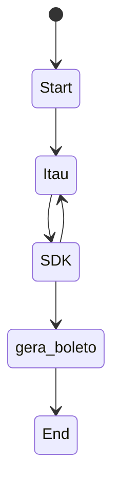

<h1 align="center">SDK para boletos do Itaú</h1>
<h3 align="center">Gere boletos de forma mais fácil com esse SDK, integrando com a API oficial<br> do Itaú e gerando PDFs no padrão do banco.</h3>
<p align="center">
        <a href="https://github.com/boletos-itau/releases](https://github.com/lucassecond/SDK-boletos-itau-v2" alt="Version">
            
        </a>
</p>

## Funcionalidades disponíveis
1) Validar credenciais e resolver API Key automaticamente.
2) Criar novo boleto através da API oficial do Itaú.
3) Gerar PDF do modelo do boleto de acordo com o padrão do Itaú.
4) Consultar boleto por número.
5) Resolver API Key automaticamente usando CLIENT_ID e CLIENT_SECRET.

## Funcionalidades pendentes
1) Adicionar pagamento por PIX.

## Configuração

### 1. Instalação
Clone o repositório e instale as dependências:
```bash
npm install
```

### 2. Variáveis de ambiente (.env)

Crie um arquivo `.env` na raiz do projeto com as variáveis abaixo. Você pode copiar o arquivo `.env.example` como base:

```bash
cp .env.example .env
```

#### Parâmetros do .env

| Variável | Obrigatório | Descrição |
|----------|-------------|-----------|
| `ITAU_CLIENT_ID` | **Sim** | Identificador do cliente (Client ID) fornecido pelo Itaú no [Developer Portal](https://devportal.itau.com.br). Usado para autenticação OAuth e pode ser usado para resolver a API Key automaticamente. |
| `ITAU_CLIENT_SECRET` | **Sim** | Chave secreta do cliente (Client Secret) associada ao Client ID. Necessária para obter o token de acesso OAuth junto à API do Itaú. |
| `ITAU_API_KEY` | **Sim*** | Chave de API do Itaú obtida no Developer Portal. Obrigatória para todas as requisições à API de boletos. O SDK pode tentar resolvê-la automaticamente usando CLIENT_ID; nesse caso, verifique se a resolução automática está funcionando. |
| `ITAU_SANDBOX_URL` | Não | URL base da API de boletos. **Padrão:** `https://sandbox.devportal.itau.com.br/itau-ep9-gtw-cash-management-ext-v2/v2` |
| `ITAU_OAUTH_URL` | Não | URL do endpoint OAuth para obtenção do token JWT. **Padrão:** `https://sandbox.devportal.itau.com.br/api/oauth/jwt` |

\* _A API Key pode ser resolvida automaticamente pelo SDK em alguns fluxos._

**Exemplo de arquivo .env:**
```env
# Credenciais Itaú Sandbox
ITAU_CLIENT_ID=seu_client_id_aqui
ITAU_CLIENT_SECRET=seu_client_secret_aqui

# API Key do Itaú (obtida no Developer Portal)
ITAU_API_KEY=sua_api_key_aqui

# URLs da API (opcional - valores padrão do sandbox)
ITAU_SANDBOX_URL=https://sandbox.devportal.itau.com.br/itau-ep9-gtw-cash-management-ext-v2/v2
ITAU_OAUTH_URL=https://sandbox.devportal.itau.com.br/api/oauth/jwt
```

### 3. Import no projeto

```typescript
import { BoletosService } from 'boletos-itau';
```

## Como usar

### Instanciar o serviço

```typescript
import { BoletosService } from 'boletos-itau';
import { BoletoBuilder } from 'boletos-itau/utils/boleto-builder';

const boletosService = new BoletosService();
```

O SDK carrega as credenciais automaticamente do arquivo `.env` ou das variáveis de ambiente do sistema.

### Validar credenciais

```typescript
const credenciais = await boletosService.validarCredenciais(true);
if (credenciais.todasValidadas) {
  console.log('✅ Todas as credenciais estão configuradas');
}
```

### Gerar tokens

```typescript
const tokens = await boletosService.gerarTokens();
// tokens.oauthToken, tokens.apiKey, tokens.correlationId, tokens.headers
```

### Criar boleto com Builder (recomendado)

```typescript
const beneficiario = BoletoBuilder.criarBeneficiario(
  '150000052061',
  'Antonio Coutinho SA',
  'J',
  undefined,
  '12345678901234',
  BoletoBuilder.criarEndereco(
    'rua dona ana neri, 368',
    'Mooca',
    'Sao Paulo',
    'SP',
    '12345678'
  )
);

const pagador = BoletoBuilder.criarPagador(
  'Antônio Coutinho',
  'J',
  undefined,
  '12345678901234',
  'itau@itau-unibanco.com.br',
  BoletoBuilder.criarEndereco(
    'rua dona ana neri, 368',
    'Mooca',
    'Sao Paulo',
    'SP',
    '12345678'
  ),
  'Empresa A'
);

const boleto = BoletoBuilder.criarBoletoCompleto({
  etapaProcesso: 'validacao',
  codigoCanalOperacao: 'API',
  beneficiario,
  pagador,
  nossoNumero: '12345678',
  dataVencimento: '2026-02-20',
  valor: 180.00,
  seuNumero: '123',
  codigoCarteira: '109',
  codigoTipoVencimento: 1,
  codigoEspecie: '01',
  descricaoEspecie: 'Duplicata de Venda Mercantil',
  codigoAceite: 'S',
  dataEmissao: '2026-02-09',
});

// Criar na API e gerar PDF automaticamente
const resposta = await boletosService.criarBoletoItau(boleto, undefined, true);
console.log(resposta);
// resposta.pdf contém o Buffer do PDF (se gerarPDF = true)
```

### Gerar PDF de um boleto existente

```typescript
// Gerar PDF como Buffer
const pdfBuffer = await boletosService.gerarPDFBoleto(resposta);

// Gerar e salvar em arquivo
await boletosService.gerarESalvarPDFBoleto(resposta, './boletos/boleto-123.pdf');
```

### Consultar boleto

```typescript
const boletoConsultado = await boletosService.consultarBoleto('123456');
```

### Fechar recursos (Puppeteer)

```typescript
await boletosService.fecharRecursos();
```

## Scripts disponíveis

```bash
# Executar aplicação principal
npm run dev

# Exemplo de criação de boleto oficial
npm run example:boleto

# Exemplo de geração de PDF
npm run example:pdf

# Testar token e credenciais
npm run test:token
```

## Observações gerais

1) Os boletos em PDF podem ser salvos em qualquer pasta que você especificar. O SDK não define um diretório padrão fixo; use `gerarESalvarPDFBoleto()` com o caminho desejado (ex: `./boletos/`).

2) Use as credenciais de **sandbox** do Itaú durante os testes. Acesse o [Developer Portal](https://devportal.itau.com.br) para obter CLIENT_ID, CLIENT_SECRET e API Key.

3) Para produção, altere `ITAU_SANDBOX_URL` e `ITAU_OAUTH_URL` para as URLs do ambiente de produção do Itaú.

4) O SDK resolve a API Key automaticamente usando CLIENT_ID quando disponível. Caso contrário, configure `ITAU_API_KEY` diretamente no `.env`.

## Fluxograma do SDK



## O que esse SDK propõe?

- **Gerar boletos válidos do Itaú** usando a API oficial EP9 (Cash Management).
- **Gerar PDF** do modelo de boleto no padrão do Itaú.
- **Simplificar** a Integração com `BoletoBuilder` e resolução automática de credenciais.

## Documentação de referência

- [API Itaú - EP9 Cash Management](https://devportal.itau.com.br/nossas-apis/itau-ep9-gtw-cash-management-ext-v2)
- [Developer Portal Itaú](https://devportal.itau.com.br)

## Melhorias pendentes

- [ ] Adicionar método de pagamento por PIX.
